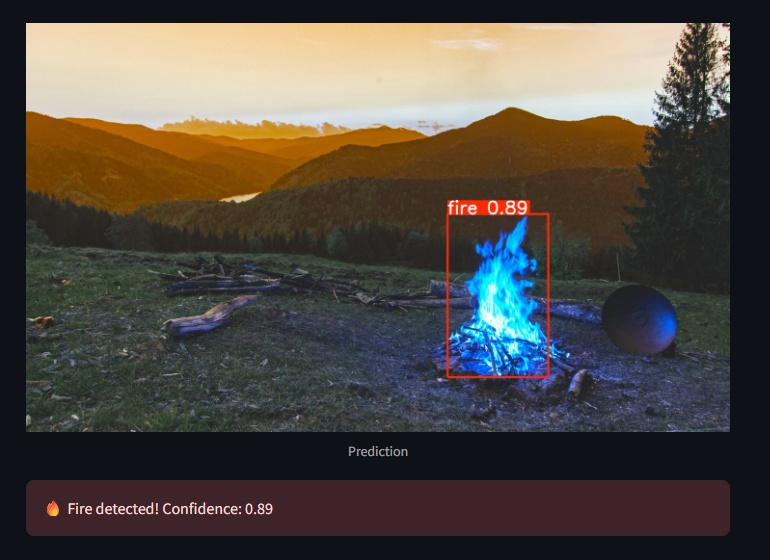

# 🔥 Fast Fire Detection



This project implements a fast and efficient fire detection system using the YOLOv8 model trained on a custom fire dataset.

## 🚀 Features

- Real-time fire detection via webcam.
- Fire detection on uploaded images.
- Easy-to-use Streamlit web application.
- Lightweight YOLOv8 small model for quick predictions.

## 🛠️ Installation

1. Clone the repository:

```bash
git clone https://github.com/onedmilson/fast_fire_detection.git
cd fast_fire_detection
```

2. Create and activate a virtual environment:
```bash
python -m venv venv
venv\Scripts\activate  # On Windows
```
3. Install dependencies:
```bash
pip install -r requirements.txt
```
## 📁 Project Structure
```bash
fast_fire_detection/
│
├── app/                   # Streamlit app code
│   └── ffd_app.py
├── models/                # Trained YOLOv8 weights
│   └── best.pt
├── notebooks/             # Notebooks for training and exploration
│   └── fast_fire_detection.ipynb
├── images/                # Screenshots or visual assets
│   └── ffd.jpg
├── requirements.txt       # Python dependencies
└── README.md              # Project overview
```
## 🎯 Usage
To run the Streamlit app:
```bash
streamlit run app/ffd_app.py
```
Choose between:  
Uploading an image for fire detection.  
Using your webcam for live fire detection.          

## ⚙️ Model Info
Trained on a [Roboflow Fire Detection Dataset (Continuous Fire)](https://universe.roboflow.com/-jwzpw/continuous_fire).  
Uses YOLOv8 small model.  
Confidence threshold set to 0.6.   

## 📄 License
MIT License.